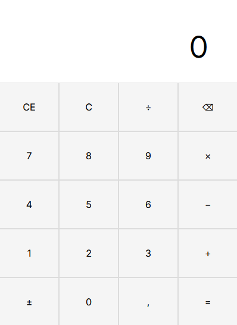

# 🧮 Calculadora Web

Calculadora simples desenvolvida com HTML, CSS e JavaScript puro (Vanilla JS), com foco em manipulação do DOM e controle de estado.

👉 **[Acesse a demonstração online](https://ph-macedo.github.io/vanilla-js-calculator/)**

## 🚀 Funcionalidades

- Operações básicas (soma, subtração, multiplicação e divisão) com números inteiros
- Inversão de sinal (+/-)
- Limpeza total da expressão (botão C)
- Prevenção contra divisão por zero

## 📌 Próximos Passos (Roadmap)

- [ ] Suporte a números decimais (botão `,`)
- [ ] Botão de apagar o último dígito (Backspace)
- [ ] Botão CE (limpar apenas o termo atual)

## 🛠️ Tecnologias

- HTML5
- CSS3
- JavaScript
